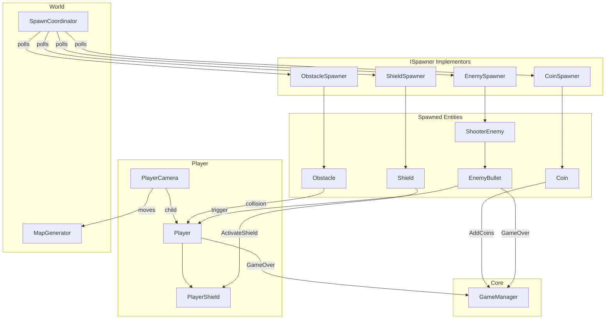

# Joyride — Architecture

This document describes the architecture **as it exists in the codebase today**, including known limitations and technical debt.

## System Overview



## Major Systems

### 1. GameManager (`Core/GameManager.cs`)

**Responsibility:** Singleton game state — coin score, game-over flag, scene restart.

- Holds `_totalCoins` and updates TMP score text.
- `GameOver()` sets `Time.timeScale = 0`.
- `Update()` listens for any key to restart via `SceneManager.LoadScene`.

**Dependencies:** TextMeshPro, SceneManagement. Referenced directly by `Player`, `Coin`, `EnemyBullet`.

### 2. Player Stack (`Player/`)

| Component | Responsibility |
|-----------|----------------|
| `PlayerCamera` | Moves camera/transform right at accelerating speed (`startSpeed` → `maxSpeed`; code defaults 5/0.5, SampleScene uses 10/0.24). Hosts MainCamera and AudioListener. Player is a child transform. |
| `Player` | Thrust on `Jump` input; enhanced fall gravity when not thrusting; Y velocity clamped. `OnCollisionEnter2D` handles obstacle hits. |
| `PlayerShield` | Timed shield buff with procedurally generated circle visual. Rotate + alpha flash before expiry. `ConsumeShield()` on hit. |

**Interaction:** Player does not move horizontally — world scroll creates the illusion of forward flight.

### 3. World Streaming (`World/`)

| Component | Responsibility |
|-----------|----------------|
| `MapGenerator` | When player passes a threshold relative to current ground segment, swaps `ground`/`prevGround` and `ceiling`/`prevCeiling` references and repositions the trailing segment +60 units ahead. |
| `SpawnCoordinator` | Singleton tick (every `spawnCheckInterval`) computes spawn X = camera X + `spawnDistance`. Enforces `minSpawnGap`. Iterates registered spawners; first eligible spawner wins (one spawn per tick). |
| `ISpawner` | Minimal contract: `bool CanSpawn()`, `void Spawn(float position)`. |

**Spawner discovery:** `FindObjectsOfType<MonoBehaviour>().OfType<ISpawner>()` at `Start()` — no manual registration.

### 4. Obstacle System (`Obstacles/`)

| Component | Responsibility |
|-----------|----------------|
| `ObstacleSpawner` | Cooldown-based spawning; tracks `activeObstacles` list; destroys obstacles behind camera (`despawnDistance`). |
| `Obstacle` | On `Start`, randomizes Y scale between `minHeight` and `maxHeight`. |

Obstacles use **non-trigger** colliders and the `"Obstacle"` tag. Player uses **collision** (not trigger) detection.

### 5. Collectible System (`Collectibles/`)

| Component | Responsibility |
|-----------|----------------|
| `CoinSpawner` | Cooldown-based; spawns one of four patterns (horizontal line, vertical line, sine curve, circle). Tracks and cleans up `activeCoins`. |
| `Coin` | Rotates; trigger collision with `"Player"` tag; calls `GameManager.AddCoins`; optional `PlayClipAtPoint`. |
| `ShieldSpawner` | Cooldown + random chance (`spawnChance`); requires prefab reference. |
| `Shield` | Bob + rotate animation; trigger pickup activates `PlayerShield`. |

### 6. Enemy System (`Enemy/`) — in scene, prefab not assigned

| Component | Responsibility |
|-----------|----------------|
| `EnemySpawner` | `ISpawner` with `enemyAlive` gate, first-spawn delay, min interval, spawn chance. References `ground`/`ceiling` for Y bounds. Falls back to `ShooterEnemy.CreateSample()` if no prefab (current scene path — `enemyPrefab` is null). |
| `ShooterEnemy` | Coroutine-driven behavior: random vertical moves (clamped to bounds), burst fire, then notifies spawner and self-destructs. `LateUpdate` locks X to `camera.x + screenHoldOffset`. |
| `EnemyBullet` | Moves in a direction; lifetime and behind-camera despawn. Trigger hit on `"Player"` — shield consume or game over. Supports prefab or `Create()` procedural fallback. |

---

## Spawning Architecture

### Coordinator pattern

```
Every spawnCheckInterval (0.5s default):
  spawnX = camera.position.x + spawnDistance (15)
  if spawnX - lastSpawnX < minSpawnGap (3 code default; 5 in SampleScene): return

  foreach spawner in spawners (discovery order):
    if spawner.CanSpawn():
      spawner.Spawn(spawnX)
      lastSpawnX = spawnX
      break   // only ONE entity per tick
```

### Per-spawner eligibility

| Spawner | CanSpawn condition |
|---------|-------------------|
| `ObstacleSpawner` | Internal cooldown elapsed (`minSpawnInterval`–`maxSpawnInterval`) |
| `CoinSpawner` | Internal cooldown elapsed |
| `ShieldSpawner` | Cooldown elapsed **and** random chance pass |
| `EnemySpawner` | No live enemy, past `firstSpawnDelay`, past `minTimeBetweenSpawns`, random chance pass |

### Spawn position

- **X:** Always passed from coordinator (`camera.x + spawnDistance`).
- **Y:** Each spawner randomizes within its own min/max. Code defaults are often `-3` to `4.5`, but **SampleScene overrides differ** — see table below.

| Spawner | Code defaults | SampleScene values |
|---------|---------------|-------------------|
| `ObstacleSpawner` | `-3` … `4.5` | `-3` … `3.5` |
| `CoinSpawner` | `-3` … `4.5` | `1` … `4` |
| `ShieldSpawner` | `-3` … `3` | `-2` … `3` |
| `EnemySpawner` | ground/ceiling Y (`-5` / `5` in scene) | ground/ceiling assigned |

### Despawn strategy

Spawners that spawn multiple instances maintain an `active*` list and destroy objects when `position.x < camera.x - despawnDistance`. Collected/destroyed objects are also pruned from lists when references become null.

**Not despawn-managed:** Shooter enemies (self-destroy after routine), enemy bullets (lifetime + behind-camera check), obstacles destroyed on contact. **Shield collectibles** have no off-screen cleanup — uncollected shields persist in the world.

### Spawner priority issue

Because the coordinator breaks after the first successful spawn and spawner order comes from `FindObjectsOfType` (non-deterministic), **which content type spawns when multiple are ready is undefined**. In practice, cooldowns stagger spawns, but simultaneous readiness favors arbitrary ordering.

---

## Pooling Architecture

**There is no object pooling.** All dynamic content uses:

```csharp
Instantiate(prefab, position, rotation)
// ...
Destroy(gameObject)
```

This applies to coins, obstacles, shields, enemies, and bullets. Lists in spawners (`activeCoins`, `activeObstacles`) track instances for cleanup only — they are not pools.

**Implications:**
- GC allocations from frequent Instantiate/Destroy under high spawn rates.
- Procedural sprite creation (`Texture2D`, `Sprite.Create`) in `PlayerShield`, `ShooterEnemy`, and `EnemyBullet` adds allocation pressure when fallback paths run.

---

## Event Architecture

**There is no event bus, ScriptableObject channels, or C# events/delegates for gameplay.**

All cross-system communication is **direct singleton or component lookup**:

| Source | Target | Mechanism |
|--------|--------|-----------|
| `Coin` | `GameManager` | `GameManager.Instance?.AddCoins()` |
| `Player` / `EnemyBullet` | `GameManager` | `GameManager.Instance.GameOver()` |
| `Shield` | `PlayerShield` | `GetComponent<PlayerShield>()` on collider |
| `ShooterEnemy` | `EnemySpawner` | `EnemySpawner.Instance.OnEnemyFinished()` |
| `ShooterEnemy` | Bounds | `EnemySpawner.Instance.ground/ceiling` |
| Spawners / cleanup | Camera | `Camera.main.transform` cached at Start |

**Tags used for collision filtering:** `"Player"`, `"Obstacle"`. Coins and shields rely on trigger + tag check. Enemy bullets check `"Player"` tag on trigger.

---

## Important Dependencies

### Singletons

| Singleton | Duplicate handling | Scene presence |
|-----------|-------------------|----------------|
| `GameManager.Instance` | Destroy duplicate | ✅ SampleScene |
| `SpawnCoordinator.Instance` | Destroy duplicate | ✅ SampleScene |
| `EnemySpawner.Instance` | Overwrites on Awake (no destroy) | ✅ SampleScene (prefab unassigned — uses `CreateSample()`) |

### Unity API dependencies

- `Camera.main` — used by spawners, enemies, bullets (requires MainCamera tag on PlayerCamera).
- `Physics2D.gravity` — read in Player for release gravity multiplier.
- `Input.GetButton("Jump")` — legacy input axis.
- `FindObjectsOfType` — spawner registration (Editor/runtime API).

### Scene hierarchy (SampleScene)

```
PlayerCamera (MainCamera, PlayerCamera script; startSpeed 10, acceleration 0.24)
  └── Player (Player, PlayerShield, Rigidbody2D, BoxCollider2D)

MapGenerator (MapGenerator script; ground/ceiling are children)
  ├── Ground (y: -5) / PrevGround
  └── Ceiling (y: 5) / PrevCeiling

SpawnCoordinator (minSpawnGap: 5)
ObstacleSpawner / CoinSpawner / ShieldSpawner / EnemySpawner
GameManager + Canvas (score TMP)
EventSystem
```

Player Z = 10 (in front of 2D plane). Ground/ceiling are static colliders for boundaries.

---

## Coding Patterns Currently Used

| Pattern | Where | Notes |
|---------|-------|-------|
| **Singleton MonoBehaviour** | GameManager, SpawnCoordinator, EnemySpawner | Static `Instance`; inconsistent duplicate handling |
| **Interface + coordinator** | ISpawner + SpawnCoordinator | Extensible spawn registration |
| **Inspector-driven config** | `[SerializeField]`, `[Header]`, public fields | Tuning without code changes |
| **Coroutine AI** | ShooterEnemy.EnemyRoutine | IEnumerator move/shoot sequences |
| **Procedural fallback assets** | ShooterEnemy.CreateSample, EnemyBullet.Create, PlayerShield.CreateShieldVisual | Runtime-generated sprites when prefabs missing |
| **Active list + distance cleanup** | CoinSpawner, ObstacleSpawner | Manual lifecycle tracking |
| **Tag-based collision** | Player, Coin, Shield, EnemyBullet | No layer matrix strategy |
| **Direct component coupling** | Shield → PlayerShield, Player → GameManager | No inversion of control |

**Not used:** namespaces, assembly definitions, dependency injection, ScriptableObject data, state machines, object pools, unit tests, async/await.

---

## Technical Debt & Code Quality Findings

### Technical debt

1. **Enemy system partially scene-integrated** — `EnemySpawner` is in `SampleScene` with ground/ceiling wired, but `enemyPrefab` is unassigned so enemies spawn via `CreateSample()`. The `ShooterEnemy` prefab still has zero move values and is unused.
2. **No object pooling** — Instantiate/Destroy throughout; will not scale with bullet bursts + coin patterns.
3. **Scattered magic numbers** — Y bounds (`-3`, `4.5`, `3.5`) duplicated across spawners, enemies, and prefab settings.
4. **Non-deterministic spawner order** — `FindObjectsOfType` order affects spawn priority when multiple spawners are ready.
5. **Debug logging in hot path** — `ShieldSpawner.CanSpawn()` logs every evaluation (called from coordinator polling).
6. **Empty / stub code** — `MapGenerator.Start()` is empty; `GameManager` imports unused `UnityEngine.UI`.
7. **Dual creation paths** — Prefab vs procedural `CreateSample`/`Create` increases test surface and inconsistency (e.g. ShooterEnemy prefab has `moveDistance: 0`, `moveDuration: 0`).
8. **No game-over UX** — Player gets frozen simulation with no on-screen feedback.

### Code smells

- **Duplicated procedural sprite generators** — Nearly identical `CreateCircleSprite` / `CreatePlaceholderSprite` in three files.
- **Singleton inconsistency** — `EnemySpawner.Instance` is public set with no duplicate guard; others use private set + Destroy.
- **ShieldSpawner early return without coordinator gap update** — Failed spawn (null prefab) still consumes coordinator turn if called... actually Spawn is called after CanSpawn, and if prefab null it returns without setting lastSpawnX from coordinator's perspective - wait, coordinator already set lastSpawnX when Spawn is called. If shield prefab is null, spawn fails but gap is consumed.
- **PlayerShield material mutation** — Modifies `material` (instantiates) rather than `sharedMaterial` or property block.
- **EnemySpawner as bounds provider** — ShooterEnemy depends on spawner singleton for level geometry rather than a neutral bounds service.

### Scalability concerns

- **Coordinator single-spawn-per-tick** — Limits content density; adding many spawner types increases competition.
- **Camera-accelerating speed** — No spawn rate scaling with speed; gaps in world time compress as speed increases.
- **FindObjectsOfType at Start** — Acceptable for one scene; breaks down with additive loading or dynamic spawner creation.
- **No difficulty curve data** — Tuning requires editing multiple MonoBehaviour inspectors.

### Potential bugs

| Issue | Severity | Detail |
|-------|----------|--------|
| ShooterEnemy prefab zero move values | High | Prefab has `moveDistance: 0`, `moveDuration: 0` — enemy won't move if instantiated from prefab |
| EnemySpawner prefab unassigned | Medium | Enemies spawn via procedural fallback; prefab path still broken (zero move values) |
| Uncollected shields never despawn | Low | `ShieldSpawner` has no active-list cleanup; missed shields accumulate off-screen |
| Shield pickup while active | Medium | `ActivateShield()` resets timer but no stacking policy documented — refreshes duration |
| Obstacle destroyed on shield hit | Medium | `Destroy(collision.gameObject)` — obstacle spawner list may hold stale reference until cleanup pass |
| `GameManager.Instance` null | Medium | Player obstacle path assumes Instance exists (no null check; Coin uses `?.`) |
| TagManager empty in ProjectSettings | Low | Scene/prefabs reference tags (Player, Obstacle, Coin) — may indicate settings sync issue; works if tags exist in editor |
| CoinSpawner object tagged "Coin" | Low | Unusual — tag on spawner GameObject, not functional issue |

### Areas needing refactoring (when prioritized)

1. Extract shared bounds provider (ground/ceiling Y) from EnemySpawner.
2. Centralize despawn/cleanup into a reusable helper or component.
3. Replace singleton calls with events or a lightweight service locator for testability.
4. Introduce object pools for coins, bullets, and obstacles.
5. Deterministic spawner priority (explicit ordered list on SpawnCoordinator).
6. Remove debug logs from ShieldSpawner.

---

## Data Flow Summary

**Score:** Coin trigger → `GameManager.AddCoins` → TMP text update.

**Damage:** Obstacle collision OR bullet trigger → shield check → consume shield OR `GameOver`.

**Spawn:** Camera moves → coordinator tick → spawner Instantiate → entity Update → behind-camera Destroy.

**World:** Camera moves → MapGenerator recycles segments → ground/ceiling colliders extend infinitely.
